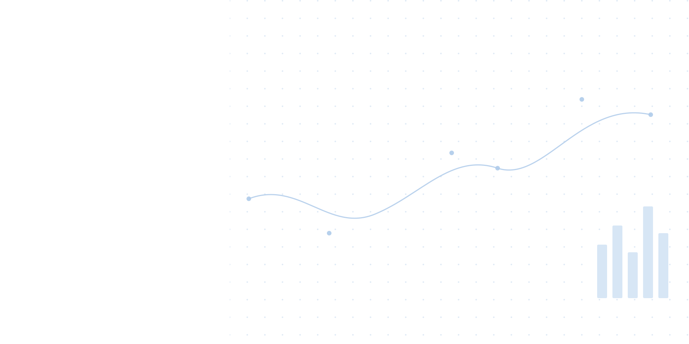

<section class="landing-page">

Razieh Ghaedi

I work on deep learning, multimodal learning, and human-centered AI, turning research on facial expression recognition, affective computing, and social impact applications into practical, responsible AI systems.

<a href="mailto:rozaghaedi90@gmail.com" aria-label="E-mail" title="E-mail"><i class="bi bi-envelope"></i></a>
<a href="https://github.com/rozaghaedi" aria-label="GitHub" title="GitHub"><i class="bi bi-github"></i></a>
<a href="https://www.linkedin.com/in/rosa-ghaedi-b15329231/" aria-label="LinkedIn" title="LinkedIn"><i class="bi bi-linkedin"></i></a>
<a href="https://scholar.google.com/citations?user=FhUWJo4AAAAJ" aria-label="Google Scholar" title="Google Scholar"><i class="bi bi-bookmark-star-fill"></i></a>

<!-- بعداً تصویر خودتون رو اینجا اضافه می‌کنیم -->

</section>
